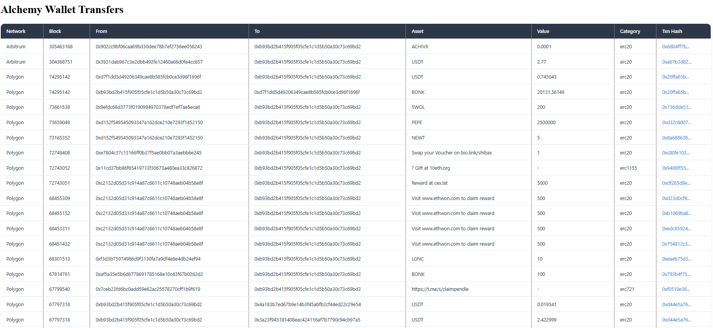

# Alchemy Wallet Transfers

Une application Angular moderne qui affiche les transferts de portefeuille Alchemy dans un tableau interactif et responsive.

## 🚀 Fonctionnalités

- **Affichage des transferts** : Visualisation des transactions de portefeuille en temps réel
- **Interface responsive** : Adaptation automatique aux écrans mobiles et desktop
- **Design moderne** : Interface utilisateur élégante avec des effets hover et transitions
- **Liens vers Etherscan** : Accès direct aux détails des transactions sur Etherscan
- **Chargement asynchrone** : Indicateur de chargement pendant la récupération des données

## 🛠️ Technologies utilisées

- **Angular 18+** avec architecture standalone
- **TypeScript** pour le typage statique
- **SCSS** pour les styles avancés
- **HttpClient** pour les appels API

## 📋 Prérequis

- Node.js (version 18 ou supérieure)
- npm ou yarn
- Angular CLI (`npm install -g @angular/cli`)

## 🔧 Installation

1. **Cloner le repository**

   ```bash
   git clone <url-du-repo>
   cd front-end/main
   ```

2. **Installer les dépendances**

   ```bash
   npm install
   ```

3. **Configurer l'API Backend**

   Assurez-vous qu'un serveur backend est en cours d'exécution sur `http://localhost:3000` avec l'endpoint `/api/transfers` qui retourne un tableau de transferts au format :

   ```json
   [
     {
       "network": "ethereum",
       "blockNum": "0x123456",
       "from": "0x...",
       "to": "0x...",
       "asset": "ETH",
       "value": "1.0",
       "category": "external",
       "hash": "0x..."
     }
   ]
   ```

## 🚦 Démarrage

**Mode développement**

```bash
ng serve
```

L'application sera accessible sur `http://localhost:4200`

**Build de production**

```bash
ng build --prod
```

## 🏗️ Structure du projet

```
src/
├── app/
│   ├── components/
│   │   └── transfer-table/
│   │       ├── transfer-table.ts      # Composant principal
│   │       ├── transfer-table.html    # Template HTML
│   │       └── transfer-table.scss    # Styles SCSS
│   ├── services/
│   │   └── transfer.ts               # Service pour les appels API
│   ├── app.config.ts                 # Configuration de l'application
│   ├── app.routes.ts                 # Configuration des routes
│   └── app.ts                        # Composant racine
├── index.html                        # Page HTML principale
└── main.ts                          # Point d'entrée de l'application
```

## 📊 Fonctionnalités du tableau (so far)

Le tableau affiche les colonnes suivantes :

- **Network** : Réseau blockchain
- **Block** : Numéro de bloc (converti depuis hexadécimal)
- **From** : Adresse expéditeur
- **To** : Adresse destinataire
- **Asset** : Type d'actif transféré
- **Value** : Valeur de la transaction
- **Category** : Catégorie de transaction
- **Txn Hash** : Hash de transaction (lien vers Etherscan)


